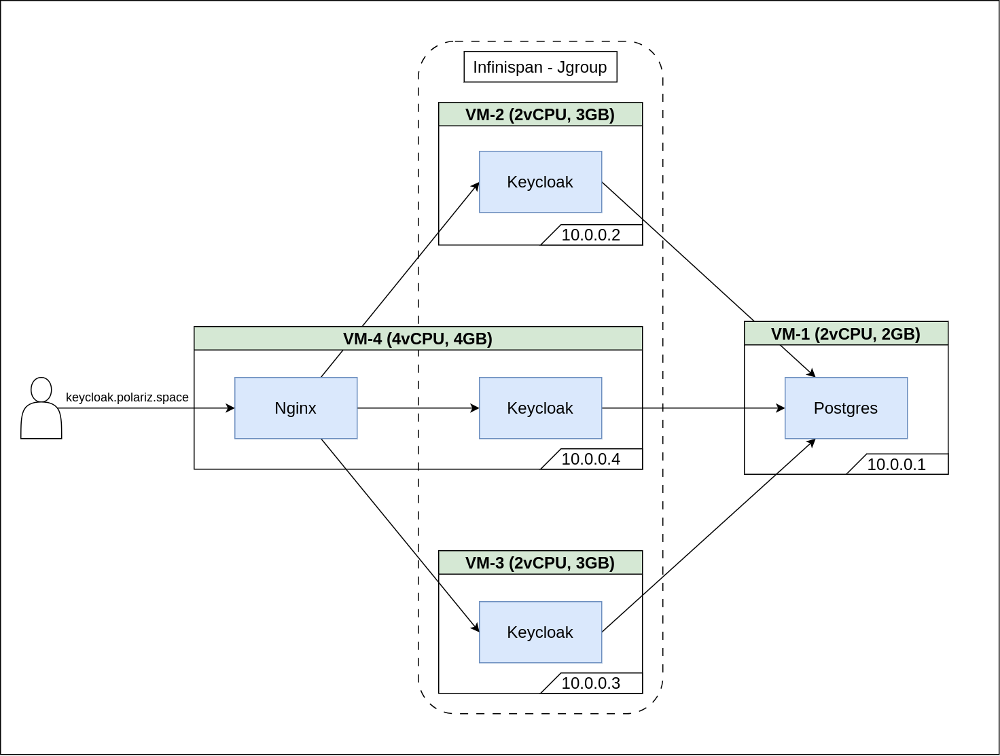

# Triển khai Keycloak Cluster trên cụm nhiều nodes

## 1. Cơ chế Distributed Caching

...

## 2. Kiến trúc triển khai

## 3. Cache stacks

- Mặc định không cần cấu hình thêm (dùng option --cache-stack=<stack-name>)
    - TCP - MPING
    - UDP - UDP_multicast
- Cần cấu hình trong file `cache-ispn.xml`
    - TCP - TCP_PING
    - TCP - JDBC_PING

## 4. Đánh giá các Cache Stacks

|Protocol|Speed|Reliability|Stability|Requirements|
|---|---|---|---|---|
|UDP-UDP_MULTICAST|high|medium|high|multicast support|
|TCP-MPING|medium|high|high|multicast support|
|TCP-TCPPING|low|high|medium|none|
|TCP-JDBCPING|low|high|low|JDBC connection to a shared database|

`UDP-UDP_MULTICAST` và `TCP-MPING` không phụ thuộc vào các thành phần bên ngoài như databse, địa chỉ của mỗi thành viên để discover các node khác. Do vậy, khi cần scale hệ thống thì rất nhanh chóng và thuận tiện. Tuy nhiên, hai protocol này yêu cầu hạ tầng hỗ trợ multicast. `UDP` sẽ có tốc độ nhanh hơn `TCP` nhưng kéo theo đó là độ tin cậy thấp hơn. Nếu hệ thống yêu cầu latency thấp thì `UDP` là transport stack phù hợp.

`TCP-TCPPING` kém ổn định và tốc độ chậm hơn so với `UDP-UDP_MULTICAST` và `TCP-MPING`. Lý do là bởi vì nó sử dụng static membership algorithm. Điều này có nghĩa là `TCP-TCPING` không có nhiều thông tin về các node trong cụm và có thể mất nhiều thời gian hơn để phát hiện và khôi phục sau khi node lỗi.

`TCP-JDBCPING` được cho là kém ổn định nhất vì giao thức này cần phải dựa trên kết nối với database để duy trì tư cách thành viên trong cụm.

## 5. Kết luận